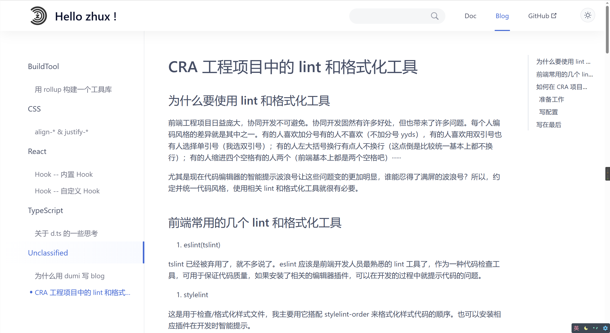
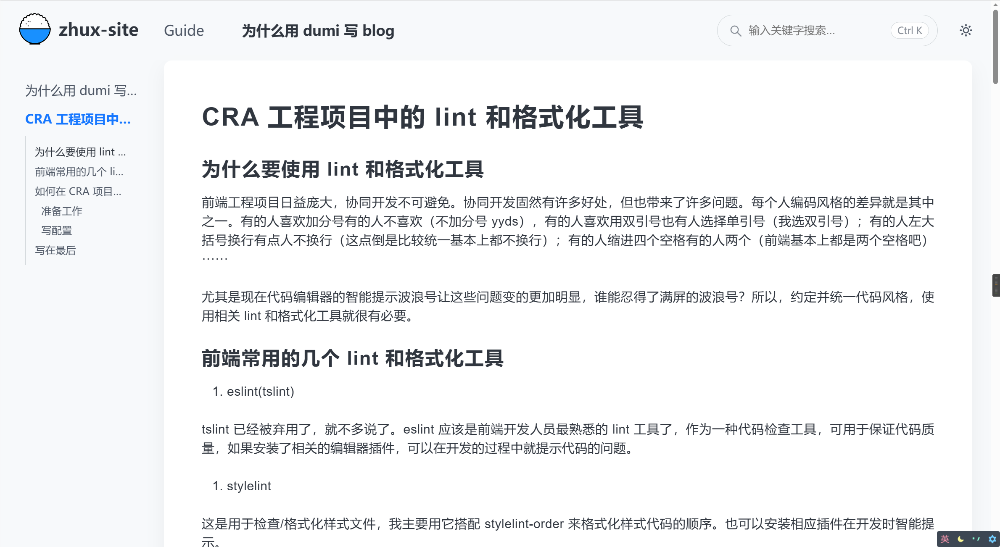

# turborepo/dumi@1.x 项目使用 GitHub Actions 部署 GitHub Pages 踩坑记录

## 为什么要使用 GitHub Actions 和 GitHub Pages 部署这个项目

之前这个项目都是手动部署到云服务器上的，最近云服务器要到期了，得换一个地方部署这个项目

花了一些时间了解了一下这两个工具

- GitHub Actions 是 GitHub 的持续集成服务，可以帮助开发者自动化软件开发流程
- GitHub Pages 是一个静态站点托管服务，可以用于托管前端页面和文档站点
- GitHub Actions 适合自动化流程，GitHub Pages 适合托管静态站点。两者可很好地协同工作

## 踩坑记录

### 1.node 版本太高导致 dumi v1.x 启动/打包失败

不知道什么时候把 node 版本升级到 18 了，在启动/打包 dumi 项目的时候会报以下错误

```bash
node:internal/crypto/hash:69
  this[kHandle] = new _Hash(algorithm, xofLen);
                  ^
Error: error:0308010C:digital envelope routines::unsupported
```

了解了一下大概是 OpenSSL3.0 对允许算法和秘钥大小增加了严格的限制

然后得到了两个解决方案

- 降级 node 到 v16
- 升级 dumi 到 v2.x

一开始是打算升级 dumi 到 v2.x，想着也顺便学习一下新版本的新特性。但是升级后觉得页面布局不如 1.x 顺眼， MarkDown 页面的导航也不如原先的好用




最终解决方案就是降级 Node 到 v16，项目正常启动，正常打包

### 2.这个 site 是 monorepo 的一个子项目，如何在根目录正确打包部署

查阅了 turbo 的文档后得知 可以直接在根目录执行以下命令来执行子项目的脚本

```bash
turbo run build --filter=zhux-site
```

而且只要正确地配置了 turbo 的 pipeline，可以保证打包项目之前先打包它的依赖

### 3.项目使用的 pnpm 作为包管理器，npm 命令不能正常使用

项目基于 pnpm workspaces，内部依赖的版本都为 `workspace:*`，pnpm 能正常解析而 npm 会找不到依赖

turbo [文档](https://turbo.build/repo/docs/ci/github-actions)有对 GitHub Actions 的配置做相关说明，使用 `pnpm/action-setup@v2.0.1` 这个 action 就可以正常使用 pnpm

### 4.非根目录部署导致资源加载失败

根据[文档](https://v1.d.umijs.org/zh-CN/guide/faq#%E9%9D%9E%E6%A0%B9%E7%9B%AE%E5%BD%95%E9%83%A8%E7%BD%B2)提示修改配置成功解决

### 5.使用 GitHub Actions 遇到的一些问题

1. action 权限不足

```bash
fatal: unable to access 'https://github.com/stupidZhu/test-dumi.git/': The requested URL returned error: 403

104 Error: Action failed with "The process '/usr/bin/git' failed with exit code 128"
```

上面的错误是因为 action 没有写入权限，使用 deploy_key/personal_token 或者给 job 添加以下配置

```yml
permissions:
  contents: write
```

2. 部署成功，但是页面展示 README 内容

根据[`peaceiris/actions-gh-pages@v3` 文档](https://github.com/marketplace/actions/github-pages-action#%EF%B8%8F-first-deployment-with-github_token)正确选择 GitHub Pages 部署分支

## 最终 workflows 配置

```yml
name: github pages

on:
  push:
    branches:
      - main

jobs:
  deploy:
    permissions:
      contents: write
    runs-on: ubuntu-latest
    steps:
      - name: Checkout
        uses: actions/checkout@v3

      - name: Use pnpm
        uses: pnpm/action-setup@v2.0.1
        with:
          version: 6.32.2

      - name: Setup Node.js environment
        uses: actions/setup-node@v3
        with:
          node-version: 18
          cache: "pnpm"

      - name: Install dependencies
        run: pnpm install

      - name: Build with dumi
        run: pnpm run build:site

      - name: Deploy
        uses: peaceiris/actions-gh-pages@v3
        with:
          github_token: ${{ secrets.GITHUB_TOKEN }}
          publish_dir: ./apps/zhux-site/dist
```

<div class="hr-with-content" data-content="更新于 2023-8-27" ></div>

后来发现 dumi v2.x 支持以下 FrontMatter 来设置目录展示在页面右边，而且不会因为 node 版本太高而打包失败。所以就花了点时间把项目升级到 dumi v2.x 了
