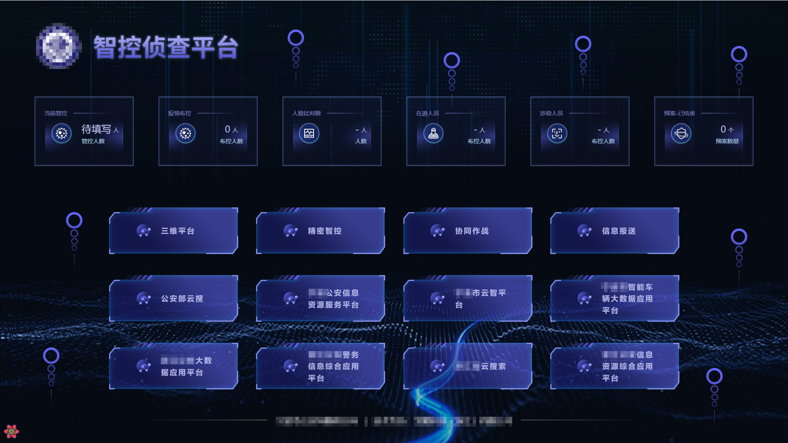
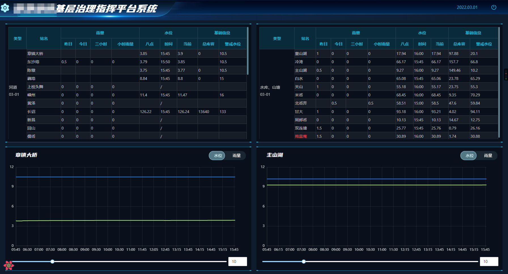
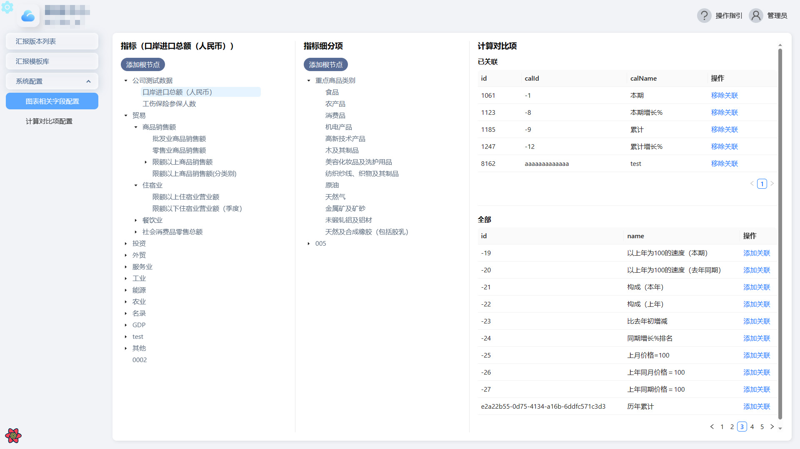
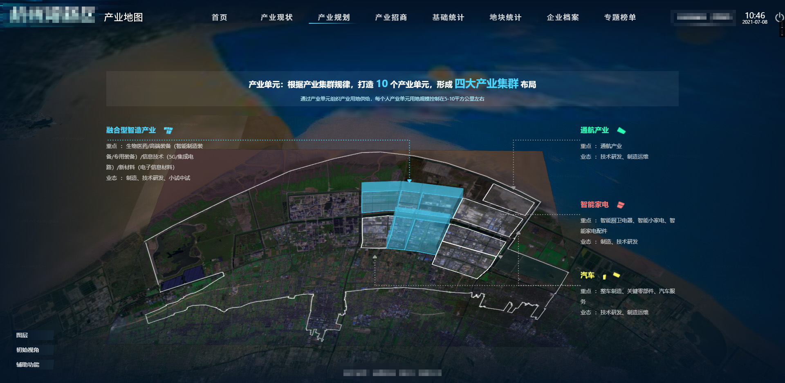

# 项目信息

## 某公安内网智控侦查大屏

### 功能简介

- 疫情/犯罪信息填报
- 内网其他平台接入
- 基于 Cesium 的三维可视化页面
- 公安内部设备（固定监控、执勤车辆、单兵执法仪、对讲机等）地图落点以及轨迹、监控视频流接入
- 重大活动安保预案，无人机模拟航飞，公安人员信息接入等模块开发
- 后台管理系统的开发等。

### 项目截图

<!--  -->

## 某镇基层网格治理信息系统

### 功能简介

- 基于 Cesium 的三维可视化页面
- 首屏驾驶舱按照村/网格维度的信息展示
- 驾驶舱信息和相关图表与地图展示联动
- 基于村/网格维度的人员/房屋/自然资源/企业信息/雨水情站点等信息接入并落图展示以及相应模块面板开发，地图点位和相应模块联动等
- 移动端用于网格员对其管理范围的人员/房屋等信息维护，事件上报
- 数据管理中心用于村/网格/人员/房屋/自然资源等信息维护以及角色，权限分配等

### 项目截图

## 某统计局内部汇报项目

### 功能简介

- 基于内部数据，通过可视化表单配置出汇报记录，实现了部分 chart 和表格的配置展示
- 支持简单的多媒体文件，网页链接，pdf 文档的配置展示
- 实现`指标`、`指标细分项`，`计算对比项`的联动配置
- 实现较为友好的新用户操作指引
- 区分展示页面和配置页面，为不同用户提供不同功能等

### 项目截图

## 其他参与开发项目

| 项目名称                       | 参与程度                                       |
| ------------------------------ | ---------------------------------------------- |
| 某能源企业内部系统             | 实现后台管理系统                               |
| 某地区产业地图项目             | 一些功能模块和地图图层的实现                   |
| 多验合一协同审批               | 基于原有系统改造，新增多验合一模块             |
| 某地区未来社区项目             | 项目搭建，实现基于 BIM 的分层分户模块          |
| 某地区数字孪生建设试点         | 接手他人项目，一些功能模块和地图图层的实现     |
| 某地区数字孪生管理平台         | 基于原有系统改造，一些功能模块和地图图层的实现 |
| 一些其他项目，就不再一一列举了 | /                                              |

